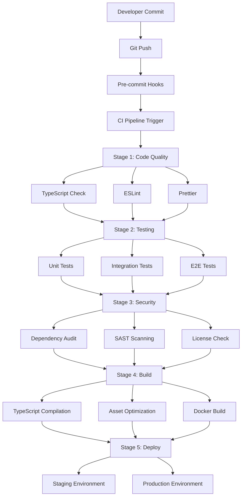

# CI/CD Pipeline Architecture
## DWAY Financial Freedom Platform

### Overview
Enterprise-grade CI/CD pipeline ensuring code quality, type safety, and production readiness for our financial platform built with Formance Stack and SuperClaude framework.

### Pipeline Architecture



### Stage 1: Code Quality Gate

#### TypeScript Validation
```bash
# Strict type checking with exactOptionalPropertyTypes
npm run typecheck
# Must pass with 0 errors for CI to continue
```

**Quality Standards:**
- ✅ Zero TypeScript compilation errors
- ✅ Strict mode compliance (`exactOptionalPropertyTypes: true`)
- ✅ All optional properties properly typed with `| undefined`
- ✅ Domain entities maintain type safety

#### Code Linting & Formatting
```bash
npm run lint        # ESLint validation
npm run lint:fix    # Auto-fix linting issues
npx prettier --check src/  # Format validation
```

**Linting Rules:**
- TypeScript ESLint configuration
- React hooks rules
- Import/export organization
- Unused variable detection
- Consistent code formatting

### Stage 2: Testing Strategy

#### Unit Testing
```bash
npm run test        # Jest unit tests
npm run test:coverage  # Coverage reporting
```

**Coverage Requirements:**
- 🎯 Minimum 80% code coverage
- 🎯 100% coverage for domain entities
- 🎯 95% coverage for service layer
- 🎯 90% coverage for infrastructure layer

#### Integration Testing
```bash
npm run test:integration
```

**Test Scenarios:**
- Formance API integration
- Multi-currency conversions
- Exchange rate provider connectivity
- Database operations
- External service mocking

#### End-to-End Testing (Puppeteer MCP)
```bash
npm run test:e2e
```

**Critical User Flows:**
- Account creation and management
- Multi-currency transfers
- Currency conversion workflows
- Transaction history retrieval
- Balance synchronization

### Stage 3: Security & Compliance

#### Dependency Security
```bash
npm audit           # Vulnerability scanning
npm audit fix       # Auto-fix security issues
```

**Security Checks:**
- 🔒 Known vulnerability scanning
- 🔒 License compliance verification
- 🔒 Dependency update recommendations
- 🔒 Supply chain security validation

#### Static Application Security Testing (SAST)
```bash
npx eslint src/ --ext .ts,.tsx --max-warnings 0
```

**Security Rules:**
- No hardcoded secrets or keys
- SQL injection prevention
- XSS protection patterns
- Input validation requirements
- Authentication/authorization checks

### Stage 4: Build & Packaging

#### Production Build
```bash
npm run build       # TypeScript compilation + optimization
```

**Build Artifacts:**
- 📦 Optimized JavaScript bundles
- 📦 Type declaration files
- 📦 Source maps for debugging
- 📦 Asset optimization (images, fonts)

#### Docker Containerization
```dockerfile
# Multi-stage build for production
FROM node:18-alpine AS builder
WORKDIR /app
COPY package*.json ./
RUN npm ci --only=production

FROM node:18-alpine AS production
WORKDIR /app
COPY --from=builder /app/node_modules ./node_modules
COPY dist ./dist
EXPOSE 3000
CMD ["npm", "start"]
```

### Stage 5: Deployment Strategy

#### Staging Environment
**Purpose:** Pre-production validation
**Infrastructure:** 
- Kubernetes cluster (staging)
- PostgreSQL database (test data)
- Redis cache (development mode)
- Formance Stack (sandbox)

**Validation Checks:**
- ✅ Health endpoint verification
- ✅ Database connectivity
- ✅ External API integration
- ✅ Performance benchmarks

#### Production Environment
**Purpose:** Live financial platform
**Infrastructure:**
- Kubernetes cluster (production)
- PostgreSQL database (encrypted)
- Redis cache (cluster mode)
- Formance Stack (production)

**Deployment Strategy:**
- 🚀 Blue-green deployment
- 🚀 Rolling updates with health checks
- 🚀 Automatic rollback on failure
- 🚀 Database migration validation

### Quality Gates & Approval Process

#### Automated Gates
1. **Code Quality**: All linting and formatting rules pass
2. **Type Safety**: Zero TypeScript compilation errors
3. **Test Coverage**: Minimum coverage thresholds met
4. **Security**: No critical vulnerabilities detected
5. **Build Success**: Production build completes successfully

#### Manual Gates
1. **Code Review**: Peer review for complex changes
2. **Architecture Review**: SuperClaude analysis for major changes
3. **Security Review**: Manual security assessment for high-risk changes
4. **Product Review**: Business logic validation

### Environment Configuration

#### Development
```yaml
environment: development
formance:
  api_url: "https://sandbox.formance.com"
  ledger: "dway-dev"
database:
  host: "localhost"
  database: "dway_dev"
logging:
  level: "debug"
```

#### Staging
```yaml
environment: staging
formance:
  api_url: "https://staging.formance.com"
  ledger: "dway-staging"
database:
  host: "staging-db.internal"
  database: "dway_staging"
logging:
  level: "info"
```

#### Production
```yaml
environment: production
formance:
  api_url: "https://api.formance.com"
  ledger: "dway-production"
database:
  host: "prod-db.internal"
  database: "dway_production"
logging:
  level: "warn"
```

### Monitoring & Alerting

#### Application Metrics
- 📊 Transaction processing rates
- 📊 API response times
- 📊 Error rates and patterns
- 📊 Currency conversion accuracy
- 📊 Account creation success rates

#### Infrastructure Metrics
- 📊 CPU and memory usage
- 📊 Database performance
- 📊 Network latency
- 📊 Container health status
- 📊 External service availability

#### Business Metrics
- 📊 Active user accounts
- 📊 Transaction volumes by currency
- 📊 Exchange rate provider reliability
- 📊 Revenue and fee collection
- 📊 Compliance audit trails

### Rollback & Disaster Recovery

#### Automated Rollback Triggers
- Health check failures > 5 minutes
- Error rate > 5% increase
- Critical dependency unavailability
- Database connection failures

#### Manual Rollback Process
1. **Immediate**: Stop traffic to failed deployment
2. **Rollback**: Revert to previous stable version
3. **Validate**: Confirm system stability
4. **Investigate**: Root cause analysis
5. **Fix Forward**: Plan corrective measures

### SuperClaude Integration Points

#### Context7 MCP: Documentation Access
- Pipeline documentation retrieval
- Architecture decision records
- API specification validation
- Compliance requirement checking

#### Sequential MCP: Multi-step Processes
- Complex deployment orchestration
- Multi-environment promotion
- Database migration sequences
- Integration testing workflows

#### Magic MCP: UI Component Testing
- Automated UI component validation
- Visual regression testing
- Accessibility compliance checking
- Cross-browser compatibility

#### Puppeteer MCP: E2E Automation
- Critical user journey testing
- Performance regression detection
- Security vulnerability scanning
- Load testing automation

### Risk Assessment Matrix

| Risk Level | Change Type | Approval Required | Testing Required |
|------------|-------------|-------------------|------------------|
| 🟢 Low | UI components, documentation | Automated | Unit + Integration |
| 🟡 Medium | Service layer, new features | Code Review | Full test suite |
| 🔴 High | Core entities, external APIs | Architecture Review | E2E + Manual QA |
| ⚫ Critical | Security, financial logic | Security + Product Review | Full validation |

### Performance Benchmarks

#### Build Performance
- 🎯 TypeScript compilation: < 2 minutes
- 🎯 Unit test execution: < 30 seconds
- 🎯 Integration tests: < 2 minutes
- 🎯 Docker build: < 5 minutes
- 🎯 Total pipeline: < 10 minutes

#### Runtime Performance
- 🎯 API response time: < 200ms (95th percentile)
- 🎯 Database queries: < 50ms average
- 🎯 Exchange rate updates: < 1 second
- 🎯 Transaction processing: < 100ms
- 🎯 Account creation: < 500ms

---

**Last Updated:** 2025-07-12  
**Version:** 1.0  
**Maintained by:** SuperClaude Development Team  
**Review Cycle:** Monthly architecture review, weekly performance optimization